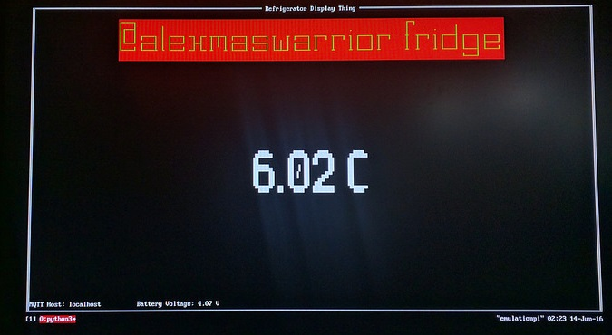

# Console Fridge Temperature Monitor

Monitors the temperature and sensor battery voltage for my home sensors project, seen at http://homesensors.alexwarrior.cc and displays it in a terminal as text based graphical display. The sensor values come from an MQTT broker.



## Requirements

 * Python 3
 * Likely does not run on Windows! Urwid has problems.
 * Paho MQTT client: ```pip install paho-mqtt```
 * urwid: ```pip install urwid```


## Running

The MQTT server and topics for the temperature and battery voltage are hard coded in the python script.  It is run as:
```python FridgeMonitor.py```